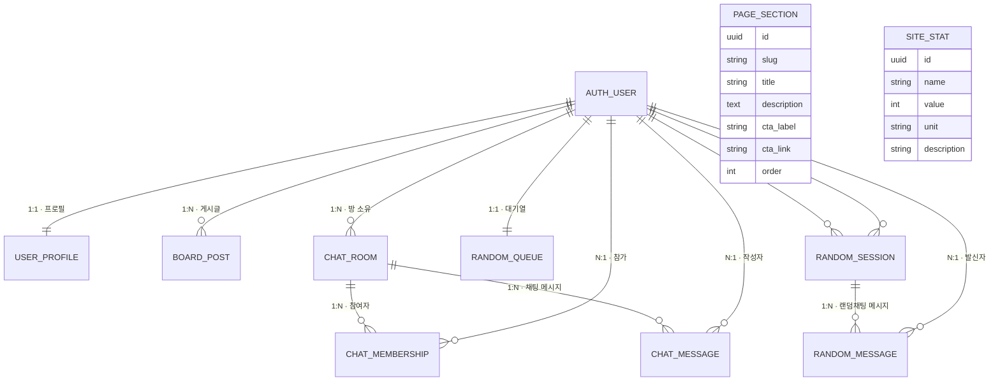

# 데이터 모델 ERD

본 문서는 `/home/ubuntu/app/backend` Django 프로젝트 전반의 핵심 모델을 개요하고, 관계를 한눈에 파악할 수 있는 ERD를 제공합니다. 기본 사용자 테이블은 Django가 제공하는 `auth_user`를 사용하며, 아래 도표에서는 간단히 `AUTH_USER`로 표기했습니다.

## 주요 관계 다이어그램

## 테이블/모델 설명

### AUTH_USER (Django 기본 사용자)
- 인증 및 권한의 기준이 되는 계정 테이블입니다.
- 커스텀 모델을 쓰지 않았으므로 Django 기본 필드(아이디, 이메일, 비밀번호 등)를 그대로 사용합니다.

### USER_PROFILE (`accounts.UserProfile`)
- `AUTH_USER`와 1:1 관계를 맺으며, 사용자명·소개·아바타 파일 경로를 별도로 보관합니다.
- 아바타 파일은 `avatars/{user_pk}-{slugified_username}/...` 경로로 저장됩니다.

### BOARD_POST (`boards.Post`)
- 게시판 글 데이터. 작성자(`author`), 제목, 본문, 첨부파일, 작성 시각을 저장합니다.
- `PostQuerySet.for_today`를 통해 “오늘 작성한 글” 같은 제한을 쉽게 계산합니다.

### CHAT_ROOM / CHAT_MEMBERSHIP / CHAT_MESSAGE (`chatrooms` 앱)
- **ChatRoom**: 실시간 오픈채팅방 정의. 소유자(`owner`), 정원(capacity), 비밀방 여부, 비밀번호 등을 가집니다.
- **ChatRoomMembership**: 유저-방 사이의 N:M 관계를 표현하는 조인 테이블입니다. 한 사용자가 여러 방에 참여할 수 있고, 한 방에도 여러 사용자가 들어옵니다.
- **ChatMessage**: 채팅 메시지 본문, 작성자, 익명 여부를 기록합니다. 방과 사용자 모두 FK로 연결됩니다.

### RANDOM_* (`randomchat` 앱)
- **RandomChatQueueEntry**: 사용자가 1:1 랜덤 채팅 매칭을 기다릴 때의 대기열 엔트리입니다. 각 사용자는 하나만 보유할 수 있습니다.
- **RandomChatSession**: 두 명의 참가자(`participant_a`, `participant_b`)를 매칭한 세션. 진행 중 여부(`is_active`), 종료 시각 등을 저장하며, `includes(user)`/`partner_for(user)` 같은 편의 메서드가 있습니다.
- **RandomChatMessage**: 특정 세션에서 오간 메시지. 발신자 FK와 타임스탬프를 가집니다.

### PAGE_SECTION / SITE_STAT (`pages` 앱)
- 랜딩 페이지의 “애플리케이션 개요” 카드와 “운영 수치” 데이터를 저장하는 단순 테이블입니다. ERD에서는 다른 모델과 직접적인 FK가 없으므로 독립 노드로 표현했습니다.

## 활용 팁
- OTP, 토큰 등 인증 관련 테이블은 Django/DRF 기본 구현(`authtoken_token`)을 사용하므로 본 ERD에서는 생략했습니다.
- ERD 다이어그램은 Mermaid 문법을 사용했습니다. GitHub, GitLab 또는 VS Code Mermaid 플러그인에서 바로 렌더링해 확인할 수 있습니다.
