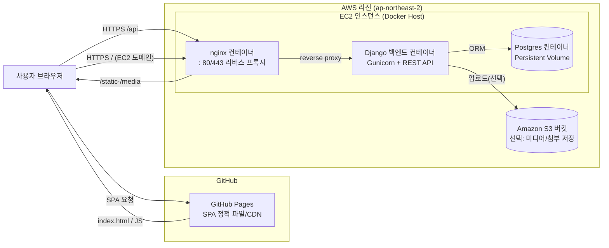

# 전체 아키텍처 개요

이 문서는 `/home/ubuntu/app` 프로젝트가 제공하는 Vue 프런트엔드, Django 백엔드, Postgres DB, nginx 리버스 프록시, GitHub Pages 정적 배포, 그리고 선택적 S3 업로드까지 한 번에 연결한 구조를 시각화합니다. 팀원이 다른 EC2 환경을 구축하더라도 아래 다이어그램과 설명을 기준 삼으면 동일한 네트워크/애플리케이션 구성을 이해하고 복제할 수 있습니다.

---

## 1. 다이어그램

---

## 2. 주요 구성 요소
- **사용자 브라우저**: GitHub Pages 도메인(`https://<username>.github.io`) 또는 EC2 도메인(`https://15-164-232-40.nip.io`)로 접속합니다. 프런트 코드에서 `window.API_BASE_URL` 또는 `VITE_API_BASE_URL`을 참조해 API 엔드포인트를 계산합니다.
- **GitHub Pages**: `frontend_build` 산출물을 커밋/푸시해 정적 SPA를 전 세계 CDN으로 배포합니다. 사용자는 여기서 최신 자바스크립트 번들을 내려받고, 이후 모든 API 요청은 EC2 백엔드로 향합니다.
- **EC2 인스턴스**: Docker Compose가 nginx / backend / db 컨테이너를 띄웁니다. 호스트의 `/home/ubuntu/app` 디렉터리를 기준으로 정적파일·미디어·DB 데이터 볼륨을 마운트합니다.
- **nginx 컨테이너**: 80 → 443 리다이렉트, `/` 요청에 대해 `frontend_build` 정적 리소스를 서빙, `/api`와 `/admin` 경로는 Django 백엔드로 프록시합니다. `/static`, `/media`는 호스트 볼륨을 그대로 노출합니다.
- **Django 백엔드 컨테이너**: Gunicorn + Django REST Framework 기반 API 서버입니다. `rest_framework.authtoken`으로 토큰 인증을 제공하고, 채팅/게시판/랜덤챗 등 도메인 앱을 포함합니다.
- **Postgres 컨테이너**: 로컬 볼륨(`dbdata/`)에 영속 데이터를 저장합니다. `DATABASE_URL` 환경변수를 통해 backend 컨테이너와 통신하며, port 5433을 통해 호스트에서도 접근 가능합니다.
- **Amazon S3 (선택)**: `.env`의 `USE_S3=1` 설정 시 미디어 업로드를 S3 버킷으로 보내도록 확장할 수 있습니다. 기본값은 로컬 `media/` 볼륨입니다.

---

## 3. 요청 및 데이터 흐름
1. **정적 리소스**  
   - 사용자 → GitHub Pages: SPA 자바스크립트/HTML/CSS를 다운로드  
   - 또는 사용자 → EC2 nginx: 동일한 `frontend_build` 정적 파일을 직접 서빙  
2. **REST API**  
   - 브라우저 → `https://15-164-232-40.nip.io/api/*`  
   - nginx → Gunicorn(Django)로 프록시, Django는 인증/비즈니스 로직 처리 후 JSON 응답  
3. **정적/미디어 자산**  
   - `/static/` 요청: nginx가 `backend/staticfiles` 볼륨을 그대로 전달  
   - `/media/` 요청: 사용자 업로드 파일을 nginx가 직접 서빙 (또는 S3)  
4. **데이터 저장**  
   - Django ORM → Postgres 컨테이너 (`dbdata/` 볼륨에 실제 파일)  
   - 필요 시 Django → S3 (미디어/첨부)  
5. **관리자/Admin**  
   - `/admin/` 경로를 nginx가 백엔드로 프록시해 Django Admin에 접근합니다.

---

## 4. 운영 포인트
- **보안 그룹**: 80/443은 전체 공개, 22는 팀원 고정 IP만 허용합니다. GitHub Pages에서 오는 API 호출은 모두 443을 통해 nginx로 유입됩니다.
- **TLS 인증서**: Let’s Encrypt 인증서를 `/home/ubuntu/app/certs`에 저장 후 nginx 컨테이너에 마운트합니다.
- **확장성**: 동일 설계를 다른 EC2에 재현하거나, 추후 ALB/WAF 앞단을 추가해 멀티 인스턴스로 확장할 수 있습니다.
- **관측성**: `docker compose logs`, CloudWatch, Sentry 등을 연동하여 nginx/백엔드/DB 로그와 메트릭을 중앙에서 모니터링합니다.

이 다이어그램과 설명을 참조하면 팀원이 프로젝트의 전체 경로(사용자 → 정적 리소스 → API → DB/S3)를 빠르게 이해하고, 아키텍처 변경 시 어떤 영향을 받는지 명확히 파악할 수 있습니다.
